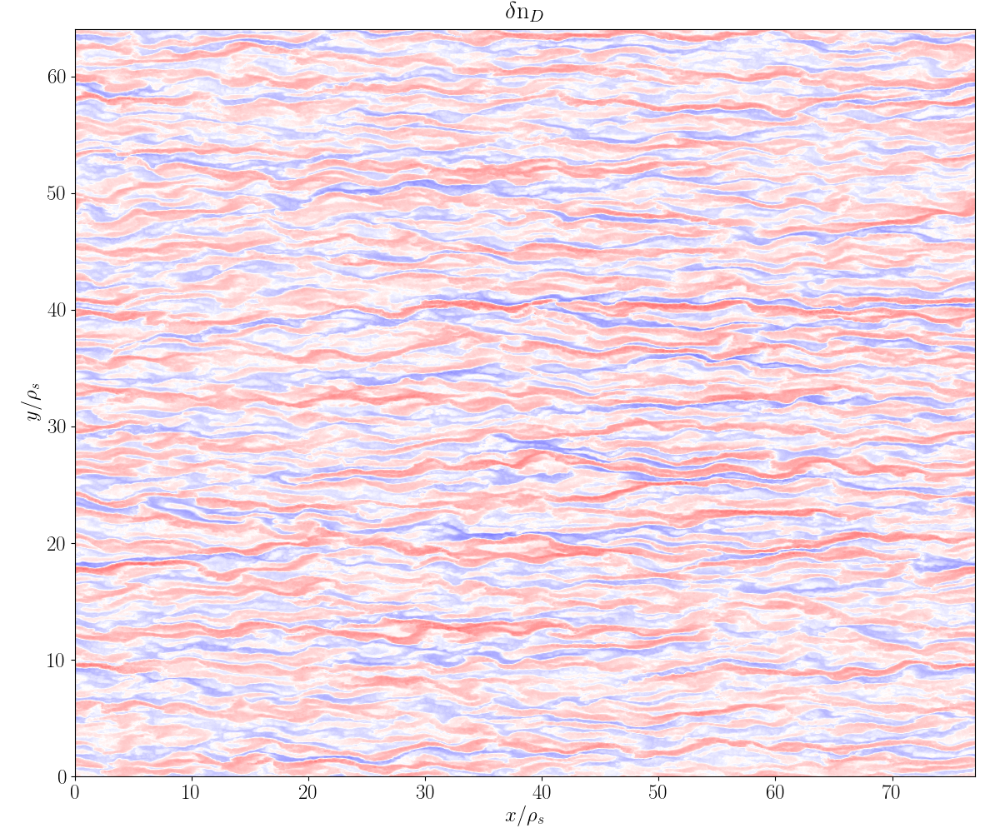
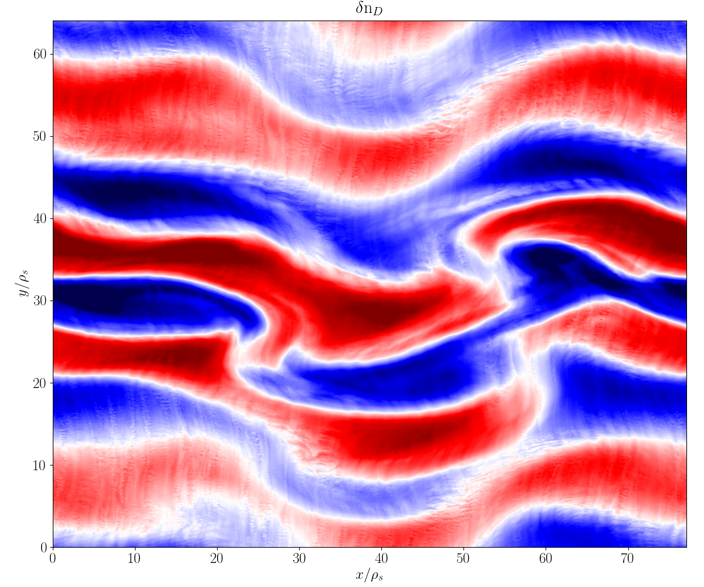
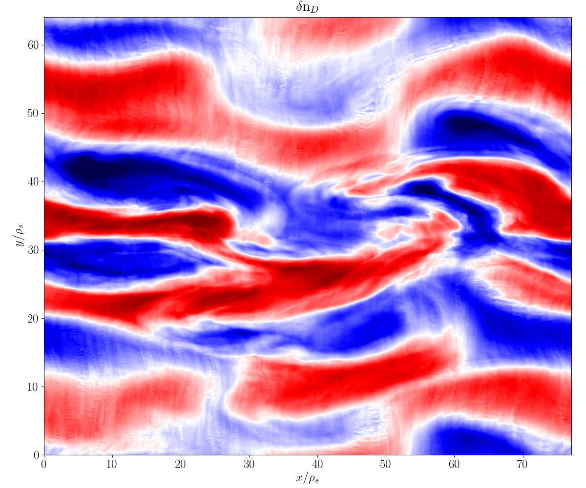
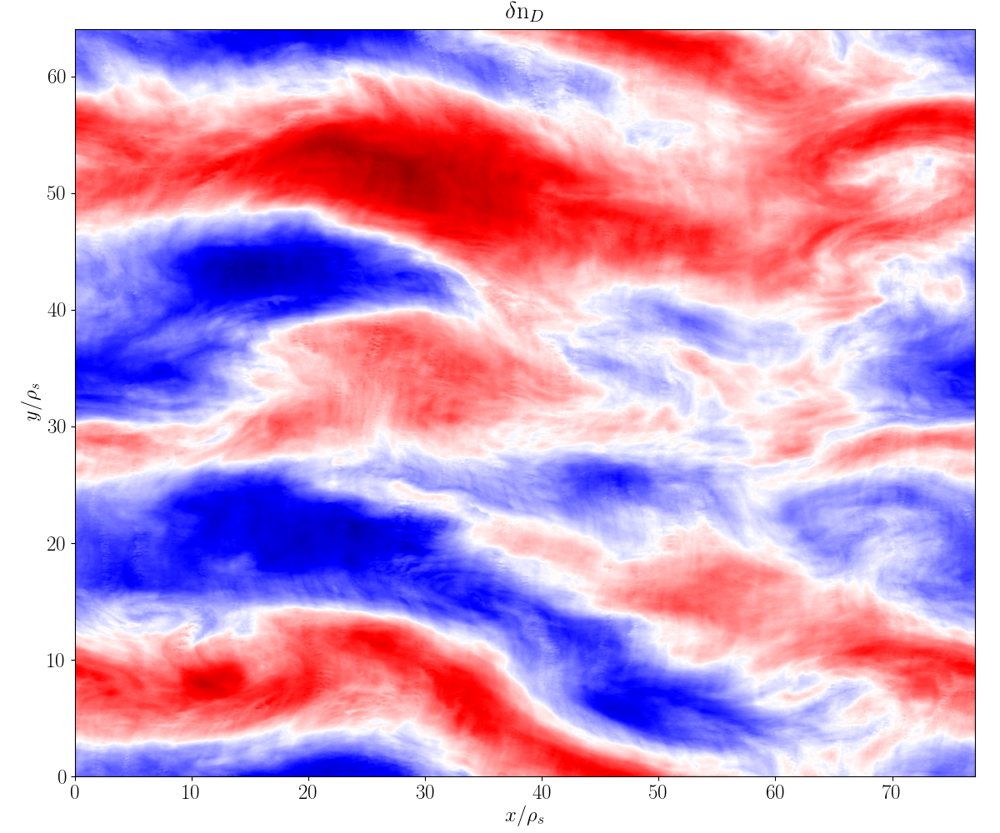

CGYRO
=====

Brief description
-----------------

CGYRO is a global-spectral gyrokinetic code.

Core developers
^^^^^^^^^^^^^^^

* Emily Belli, `General Atomics <https://www.ga.com/>`_ 
* Jeff Candy, `General Atomics <https://www.ga.com/>`_
* Klaus Hallatschek, `IPP <https://www.ipp.mpg.de/>`_ 
* Igor Sfiligoi, `SDSC <https://www.sdsc.edu/>`_ 

Notable publications
^^^^^^^^^^^^^^^^^^^^

.. csv-table:: **List of CGYRO algorithm publications**
   :header: "Title", "Link"
   :widths: 40, 10 

   A high-accuracy Eulerian gyrokinetic solver for collisional plasmas, :cite:`candy:2016`
   Implications of advanced collision operators for gyrokinetic simulation, :cite:`belli:2017`
   Spectral treatment of gyrokinetic shear flow, :cite:`candy:2018`
   Spectral treatment of gyrokinetic profile curvature, :cite:`candy:2020`
   Paradigm for global gyrokinetic turbulence, :cite:`candy:2025`
   

.. csv-table:: **List of CGYRO performance optimization publications**
   :header: "Title", "Link"
   :widths: 40, 10 

   Multiscale-optimized plasma turbulence simulation on petascale architechtures, :cite:`candy:2019`
   Comparing single-node and multi-node performance of an important fusion HPC code benchmark, :cite:`belli:2022`
   Optimization and portability of a fusion OpenACC-based HPC code from NVIDIA to AMD GPUs, :cite:`sfiligoi:2023`
   
GitHub source repository
^^^^^^^^^^^^^^^^^^^^^^^^

Released under Apache2 license:

.. code::
   
   $ git clone git@github.com:gafusion/gacode.git

Input parameters
----------------

Normalization
^^^^^^^^^^^^^

.. csv-table:: **CGYRO Normalization**
   :header: "Quantity", "Unit", "Description"
   :widths: 16, 12, 20	 

   length, :math:`a`, minor radius
   mass, :math:`m_\mathrm{D}`, deuterium mass = :math:`3.345\times 10^{24} g`
   density, :math:`n_e`, electron density
   temperature, :math:`T_e`, electron temperature 
   velocity, :math:`c_s = \sqrt{T_e/m_\mathrm{D}}`, deuterium sound speed
   time, :math:`a/c_s`, minor radius over sound speed

Tabular list
^^^^^^^^^^^^

* :ref:`tab-shape`
* :ref:`tab-advshape`
* :ref:`tab-control`
* :ref:`tab-fields`
* :ref:`tab-resolution`
* :ref:`tab-dissipation`
* :ref:`tab-time`
* :ref:`tab-species`
* :ref:`tab-collisions`
* :ref:`tab-rotation`
* :ref:`tab-global`
* :ref:`tab-output`
* :ref:`tab-optimization`

.. _tab-shape:
  
.. csv-table:: **Plasma shape/geometry**
   :header: "input.cgyro parameter", "Short description", "Default"
   :widths: 13, 25, 5

   ":ref:`cgyro_equilibrium_model`", Geometry model selector,2
   ":ref:`cgyro_rmin`", Normalized minor radius,0.5
   ":ref:`cgyro_rmaj`", Normalized major radius,3.0
   ":ref:`cgyro_shift`", Shafranov shift,0.0
   ":ref:`cgyro_kappa`", Elongation,1.0
   ":ref:`cgyro_s_kappa`", Elongation shear,0.0
   ":ref:`cgyro_delta`", Triangularity,0.0
   ":ref:`cgyro_s_delta`", Triangularity shear,0.0
   ":ref:`cgyro_zeta`", Squareness,0.0
   ":ref:`cgyro_s_zeta`", Squareness shear,0.0
   ":ref:`cgyro_zmag`", Elevation,0.0
   ":ref:`cgyro_dzmag`", Gradient of elevation,0.0
   ":ref:`cgyro_q`", Safety factor,2.0
   ":ref:`cgyro_s`", Magnetic shear,1.0
   ":ref:`cgyro_btccw`", Field orientation,-1.0
   ":ref:`cgyro_ipccw`", Current orientation,-1.0
   ":ref:`cgyro_udsymmetry_flag`", Enforce up-down symmetry,1

.. _tab-advshape:

.. csv-table:: **Advanced shape parameters**
   :header: "input.cgyro parameter", "Short description", "Default"
   :widths: 13, 25, 5

   ":ref:`cgyro_shape_cos0`", Tilt,0.0
   ":ref:`cgyro_shape_s_cos0`", Tilt shear,0.0
   ":ref:`cgyro_shape_cos1`", Ovality,0.0
   ":ref:`cgyro_shape_s_cos1`", Ovality shear,0.0
   ":ref:`cgyro_shape_cos2`", 2nd antisymmetric moment,0.0
   ":ref:`cgyro_shape_s_cos2`", 2nd antisymmetric moment shear,0.0
   ":ref:`cgyro_shape_cos3`", 3rd antisymmetric moment, 0.0
   ":ref:`cgyro_shape_s_cos3`", 3rd antisymmetric moment shear,0.0
   ":ref:`cgyro_shape_sin3`", 3rd symmetric moment, 0.0
   ":ref:`cgyro_shape_s_sin3`", 3rd symmetric moment shear,0.0

.. _tab-control:

.. csv-table:: **Control parameters**
   :header: "input.cgyro parameter", "Short description", "Default"
   :widths: 13, 25, 5

   ":ref:`cgyro_profile_model`", Profile input selector,1
   ":ref:`cgyro_quasineutral_flag`", Toggle quasineutrality,1
   ":ref:`cgyro_nonlinear_flag`", Toggle nonlinear simulation,0
   ":ref:`cgyro_zf_test_mode`", Control zonal flow testing,0
   ":ref:`cgyro_silent_flag`", Toggle silent output,0
   ":ref:`cgyro_amp`", Initial :math:`n>0` amplitude,0.1
   ":ref:`cgyro_amp0`", Initial :math:`n=0` amplitude,0.0

.. _tab-fields:

.. csv-table:: **Fields**
   :header: "input.cgyro parameter", "Short description", "Default"
   :widths: 13, 25, 5

   ":ref:`cgyro_n_field`", Number of fields to evolve,1
   ":ref:`cgyro_betae_unit`", Electron beta,0.0
   ":ref:`cgyro_betae_unit_scale`", Electron beta scaling parameter,0.0
   ":ref:`cgyro_beta_star_scale`", Pressure gradient scaling factor,1.0
   ":ref:`cgyro_lambda_debye`", Debye length,0.0
   ":ref:`cgyro_lambda_debye_scale`", Debye length scaling factor,0.0

.. _tab-resolution:

.. csv-table:: **Numerical Resolution**
   :header: "input.cgyro parameter", "Short description", "Default"
   :widths: 13, 25, 5

   ":ref:`cgyro_n_radial`", Number of radial :math:`k_x^0` wavenumbers,4
   ":ref:`cgyro_box_size`", Radial domain size,1
   ":ref:`cgyro_n_toroidal`", Number of binormal :math:`k_y` wavenumbers,1
   ":ref:`cgyro_ky`", Binormal wavenumber or domain size,0.3
   ":ref:`cgyro_n_theta`", Number of poloidal :math:`\theta` gridpoints,24
   ":ref:`cgyro_n_xi`", Number of pitch angle :math:`\xi` gridpoints,16
   ":ref:`cgyro_n_energy`", Number of energy :math:`u` gridpoints,8
   ":ref:`cgyro_e_max`", Maximum energy ,8.0
   ":ref:`cgyro_nl_single_flag`", Use FP64 or FP32 math for nonlinear term,0

.. _tab-dissipation:

.. csv-table:: **Numerical Dissipation**
   :header: "input.cgyro parameter", "Short description", "Default"
   :widths: 13, 25, 5

   ":ref:`cgyro_up_radial`", Radial spectral upwind scaling,1.0
   ":ref:`cgyro_up_theta`", Poloidal upwind scaling,1.0
   ":ref:`cgyro_up_alpha`", Binormal spectral upwind scaling,0.0
   ":ref:`cgyro_nup_radial`", Radial spectral upwind order,3
   ":ref:`cgyro_nup_theta`", Poloidal upwind order,3
   ":ref:`cgyro_nup_alpha`", Binormal spectral upwind order,3
   ":ref:`cgyro_upwind_single_flag`", Use reduced precision communication,0

.. _tab-time:

.. csv-table:: **Time Stepping**
   :header: "input.cgyro parameter", "Short description", "Default"
   :widths: 13, 25, 5

   ":ref:`cgyro_delta_t_method`", Time integrator selection,0
   ":ref:`cgyro_delta_t`", Time step,0.01
   ":ref:`cgyro_error_tol`", Error tolerance,1e-4
   ":ref:`cgyro_max_time`", Simulation time ,1.0
   ":ref:`cgyro_freq_tol`", Error tolerance for frequency,0.001
   ":ref:`cgyro_print_step`", Data output interval,100
   ":ref:`cgyro_restart_step`", Restart data output interval,10

.. _tab-species:

.. csv-table:: **Species-related parameters**
   :header: "input.cgyro parameter", "Short description", "Default"
   :widths: 13, 25, 5

   ":ref:`cgyro_n_species`", Number of GK species (ions plus electrons), 1
   ":ref:`cgyro_z`", Species charge, 1
   ":ref:`cgyro_mass`", Species mass, 1.0
   ":ref:`cgyro_dens`", Species density, 1.0
   ":ref:`cgyro_temp`", Species temperature, 1.0
   ":ref:`cgyro_dlnndr`", Species density gradient, 1.0
   ":ref:`cgyro_dlntdr`", Species temperature gradient, 1.0
	    
.. _tab-collisions:

.. csv-table:: **Collisions**
   :header: "input.cgyro parameter", "Short description", "Default"
   :widths: 13, 25, 5

   ":ref:`cgyro_nu_ee`", Electron-electron collision frequency, 0.1
   ":ref:`cgyro_collision_model`", Collision model selector, 4
   ":ref:`cgyro_collision_field_model`", Toggle self-consistent field update,1
   ":ref:`cgyro_collision_mom_restore`", Toggle momentum conservation,1
   ":ref:`cgyro_collision_ene_restore`", Toggle energy conservation,1
   ":ref:`cgyro_collision_ene_diffusion`", Toggle energy diffusion,1
   ":ref:`cgyro_collision_kperp`", Toggle so-called FLR term, 0
   ":ref:`cgyro_collision_precision_mode`", Reduce Sugama memory use, 0

.. _tab-rotation:

.. csv-table:: **Rotation physics**
   :header: "input.cgyro parameter", "Short description", "Default"
   :widths: 13, 25, 5

   ":ref:`cgyro_rotation_model`", Rotation model selector,1
   ":ref:`cgyro_gamma_e`", Dopper shearing rate (:math:`E \times B` shear), 0.0
   ":ref:`cgyro_gamma_p`", Rotation shearing rate, 0.0
   ":ref:`cgyro_mach`", Rotation speed (Mach number), 0.0
   ":ref:`cgyro_gamma_e_scale`", Doppler shearing rate scaling factor, 1.0
   ":ref:`cgyro_gamma_p_scale`", Rotation shearing rate scaling factor, 1.0
   ":ref:`cgyro_mach_scale`", Rotation speed scaling factor, 1.0 

.. _tab-global:

.. csv-table:: **Global-spectral parameters**
   :header: "input.cgyro parameter", "Short description", "Default"
   :widths: 13, 25, 5

   ":ref:`cgyro_n_global`", Global output resolution, 4
   ":ref:`cgyro_nu_global`", Source rate, 15.0
	    
.. _tab-output:

.. csv-table:: **Output file control**
   :header: "input.cgyro parameter", "Short description", "Default"
   :widths: 13, 25, 5

   ":ref:`cgyro_field_print_flag`", Output of electromagnetic field components, 0
   ":ref:`cgyro_moment_print_flag`", Output of density and energy moments, 0
   ":ref:`cgyro_gflux_print_flag`", Output of global flux profiles, 0
   ":ref:`cgyro_h_print_flag`", Output of distribution (single-mode only), 0

.. _tab-optimization:

.. csv-table:: **Optimization related parameters**
   :header: "input.cgyro parameter", "Short description", "Default"
   :widths: 13, 25, 5

   ":ref:`cgyro_toroidals_per_proc`", How many toroidal harmonics per MPI process,1
   ":ref:`cgyro_collision_precision_mode`", Use FP64 or FP32 constants for the cmat constants,0
   ":ref:`cgyro_nl_single_flag`", Use FP64 or FP32 math for nonlinear term,0
   ":ref:`cgyro_mpi_rank_order`", Relative ordering of MPI ranks,2
   ":ref:`cgyro_velocity_order`", What internal velocity order to use,1
   ":ref:`cgyro_gpu_bigmem_flag`", Enable GPU offload when possible, 1

* :doc:`Alphabetical list <cgyro/cgyro_list>`
* Profile data: :ref:`input.gacode`.
   
Output data
-----------

Files
^^^^^

It is **not recommended** to read these files directly.  Rather, we encourage the use
of the CGYRO python data interface.

.. csv-table:: **Time-independent output**
   :header: "Filename", "Short description"
   :widths: 20, 30

   out.cgyro.egrid,Energy mesh and various weights
   out.cgyro.equilibrium,Physics input data
   out.cgyro.grids,Mesh dimensions and coordinates
   out.cgyro.hosts,MPI ranks and hostnames
   out.cgyro.info,Human-readable description of simulation
   out.cgyro.memory,Memory usage statistics
   out.cgyro.mpi,Recommendations for choosing MPI tasks and OMP threads
   out.cgyro.version,Version information and timestamp for simulation
   bin.cgyro.geo,GK equation coefficients versus :math:`\theta`

.. csv-table:: **Common time-dependent output**
   :header: "Filename", "Short description", "Switch"
   :widths: 20,25,15

   out.cgyro.time,Time and error vector
   out.cgyro.timing,Kernel timer data
   bin.cgyro.freq, Mode frequency vector
   bin.cgyro.kxky_phi, ":math:`\delta\phi(k_x^0,k_y,t)`",
   bin.cgyro.kxky_apar, ":math:`\delta A_\parallel(k_x^0,k_y,t)`",":ref:`cgyro_field_print_flag` = 1"
   bin.cgyro.kxky_bpar, ":math:`\delta B_\parallel(k_x^0,k_y,t)`",":ref:`cgyro_field_print_flag` = 1"
   bin.cgyro.kxky_n, ":math:`\delta n_a(k_x^0,k_y,t)`",":ref:`cgyro_moment_print_flag` = 1"
   bin.cgyro.kxky_e, ":math:`\delta E_a(k_x^0,k_y,t)`",":ref:`cgyro_moment_print_flag` = 1"
   bin.cgyro.kxky_v, ":math:`\delta v_a(k_x^0,k_y,t)`",":ref:`cgyro_moment_print_flag` = 1"
   bin.cgyro.ky_flux, ":math:`\Gamma_a, \Pi_a, Q_a` versus :math:`(k_y,t)`" 
   bin.cgyro.ky_cflux, ":math:`\Gamma_a, \Pi_a, Q_a` (half domain) versus :math:`(k_y,t)`" 

.. csv-table:: **Restart data**
   :header: "Filename", "Short description"
   :widths: 20, 30

   out.cgyro.tag,Restart tag file (contains time index and value)
   bin.cgyro.restart,Binary restart file

Normalization
^^^^^^^^^^^^^

Ion sound gyroradius

.. math::
   \rho_{s,{\rm unit}} = \frac{c_s}{e B_{\rm unit}/(m_D c)}

Ion sound speed 

.. math::
   c_s=\sqrt{T_e/m_D}

gyroBohm particle flux

.. math::
   \Gamma_{\rm GB} = n_e c_s (\rho_{s,{\rm unit}}/a)^2

gyroBohm momentum flux

.. math::
   \Pi_{\rm GB} = n_e a T_e (\rho_{s,{\rm unit}}/a)^2

gyroBohm energy flux

.. math::
   Q_{\rm GB} = n_e c_s T_e (\rho_{s,{\rm unit}}/a)^2

Python interface
^^^^^^^^^^^^^^^^

It is suggested that users use the python interface to read CGYRO output data.
   
Simulation images
^^^^^^^^^^^^^^^^^

Simulation data courtesy Nathan Howard (MIT)

   
FAQ
---

.. toggle-header::
   :header: What is :math:`k_y \rho_s` and why does CGYRO modify :math:`\rho_s` ?

	    The fundamental definition of the wavenumber and unit gyroradius are given in :cite:`candy:2016`.
	    These are
	    
	    .. math:: \begin{align}
		      k_y \doteq &~nq/r \; , \\
		      \rho_s \doteq &~\rho_{s,\rm{unit}} = \frac{e B_\rm{unit}}{m_D c} \; , \\
		      B_\rm{unit} \doteq &~\displaystyle \frac{q}{r} \frac{\partial \psi}{\partial r} \; .
		      \end{align}

            Here, :math:`B_\rm{unit}` is the *Waltz effective magnetic field* which is standard
	    across all GACODE tools/codes, and :math:`r` is the midplane minor radius.  For a given
	    value of :math:`k_y \rho_s`, the gyrokinetic equations are invariant to the scaling
	    :math:`n \rightarrow \alpha n` and :math:`\rho_s \rightarrow \rho_s/\alpha`,
	    where :math:`\alpha` is an arbitrary scaling parameter.

            The CGYRO input parameter KY is

	    .. math:: \mathtt{KY} \doteq \Delta(k_y \rho_s) = \Delta n \left(\frac{q}{r}\right) \rho_s \; .

            CGYRO enforces :math:`\Delta n = 1`, which sets the (artificial) value of :math:`\rho_s` to
	    
	    .. math:: \rho_s \rightarrow \left(\frac{r}{q}\right) \mathtt{KY} \; .

	    To see the physical values of key parameters, you can use profiles_gen:
	    
	    .. code-block:: 

	       $ profiles_gen -i input.gacode -loc_rad 0.6
	       INFO: (profiles_gen) input.gacode is autodetected as GACODE.
	       INFO: (locpargen) Quasineutrality NOT enforced.
	       INFO: (locpargen) rhos/a   =+2.44577E-03
	       INFO: (locpargen) Te [keV] =+8.81550E-01
	       INFO: (locpargen) Ti [keV] =+7.58644E-01
	       INFO: (locpargen) Bunit    =+2.92020E+00
	       INFO: (locpargen) beta_*   =+4.84003E-03
	       INFO: ----->  n=1: ky*rhos =-7.74754E-03
	       INFO: (locpargen) Wrote input.*.locpargen

		      
.. toggle-header::
   :header: How does adaptive time-stepping work?

	    Time-stepping is controlled with the parameter :ref:`cgyro_delta_t_method`. Setting the parameter
	    to 0 gives the legacy fixed timestep, whereas values greater than 0 are adaptive methods. For the
	    adaptive methods we recommend setting :ref:`cgyro_delta_t` = 0.01. Here is the recommendation:

	    .. code-block:: 

	       DELTA_T_METHOD=1
	       DELTA_T=0.01
	       PRINT_STEP=100

	    The overall time-integration step is split between an explicit high-order step, and an implicit
	    second-order step for collisions and trapping. When using the adaptive method, the value of
	    :ref:`cgyro_delta_t` is the size of the (large) implicit timestep. Then, the value of the explicit
	    timestep is decreased to match the error tolerance, :ref:`cgyro_error_tol` -- the default value of
	    which should be sufficient.

.. toggle-header::
   :header: Why did you start over with CGYRO?

	    **The past: GYRO**

	    Over the past two decades, the fusion community has focused its modeling efforts primarily on the
	    core region. A popular kinetic code used for this purpose was
	    GYRO :cite:`candy:2003,candy:2003b,candy:2004a,candy:2010`. Thousands of nonlinear simulations
	    with GYRO have informed the fusion community's understanding of core plasma
	    turbulence :cite:`kinsey:2005,kinsey:2006,kinsey:2007,howard:2016b` and provided a *transport database*
	    for the calibration of reduced transport models such as TGLF :cite:`staebler:2007`.  GYRO was the
	    first global electromagnetic solver, and pioneered the development of numerical algorithms for the
	    GK equations with kinetic electrons.  It is formulated in real space and like all global solvers
	    requires *ad hoc* absorbing-layer boundary conditions when simulating cases with profile variation.
	    This approach is suitable for core turbulence simulations, which cover a large radial region and are
	    dominated by low wavenumbers.

	    **The future: CGYRO**

	    As the understanding of core transport has become increasingly complete, the
	    cutting edge of research moved radially toward the pedestal region, where plasmas are
	    characterized by larger collisionality and steeper pressure gradients that
	    greatly modify the turbulent phenomena at play. This motivated the development,
	    from scratch, of the CGYRO code :cite:`candy:2016,belli:2017,belli:2018,candy:2019`
	    to complement GYRO.  CGYRO is an Eulerian GK solver specifically designed and
	    optimized for **collisional, electromagnetic, multiscale simulation**.
	    A key algorithmic aspect of CGYRO is the **radially spectral formulation**
	    used to reduce the complicated integral gyroaveraging kernel into a
	    multiplication in wavenumber space, but retaining the ability to treat profile
	    variation important for edge plasmas :cite:`candy:2018,candy:2020`.  A new coordinate system that is more
	    suitable for the highly collisional and shaped edge regime was adopted from
	    the NEO code :cite:`belli:2008,belli:2012`, which is the community standard for
	    calculation of collisional transport in toroidal geometry.

.. toggle-header::
   :header: How do you run a simple linear case?

	    .. code::

	       $ cgyro -g reg08
	       $ cd reg08
	       $ cgyro -e .
	       $ cgyro_plot -plot ball -field 1
   

	    .. image:: images/cgyro/out.cgyro.ball.png
		:width: 90 %
	       

.. toggle-header::
   :header: How do I run a pre-existing template case?
		
	    The input files and configuration for numerous linear and nonlinear cases can
	    be auto-generated using the ``-g`` flag.  Often, it is easiest to find a template case
	    that is close to what you would like to run, and then modify it accordingly.
	    A list of all regression and template cases in generated by typing::

	      $ cgyro -g

	    A very simple nonlinear case is ``nl00``.  You can generate the template with::

	      $ cgyro -g nl00

	    It is **strongly suggested** that you first run your case in *test mode* using the ``-t`` flag::

	      $ cgyro -t nl00

	    On the large systems at NERSC, ORNL and elsewhere, you will need to establish an **interactive queue**
	    to execute the command above.  The result should be diagnostics printed to the screen plus a few output
	    files.  Pay attention to the file ``out.cgyro.mpi``. This shows the acceptable number of MPI tasks.

.. toggle-header::
   :header: How do I submit a batch job?

	    On established platforms, the burden of writing batch script files and setting core counts is managed
	    by the ``gacode_qsub`` script.  To generate a ``batch.src`` file, you could type::

	      $ gacode_qsub -e nl01 -n 512 -nomp 2 -queue regular -repo atom -w 0:09:00 

	    Additional flags are also accepted. Adding the ``-s`` flag to the above will submit the job.
