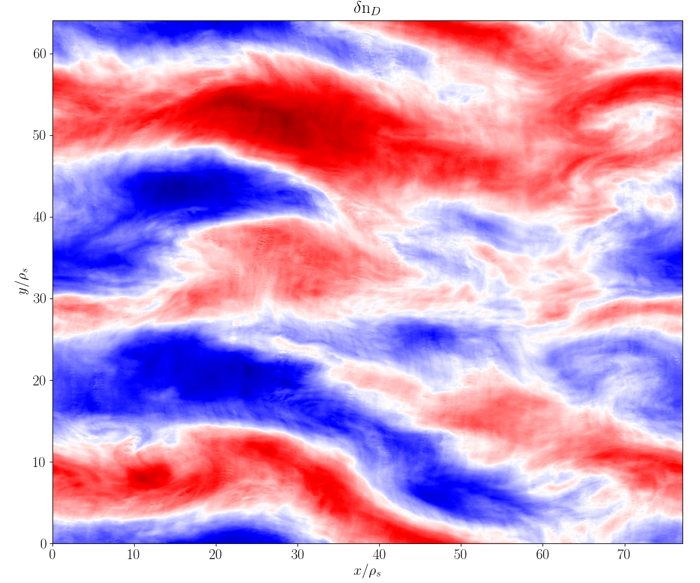

CGYRO
=====

.. image:: cgyro/figures/b250.png
	:width: 48 %
	:alt: b250
.. image:: cgyro/figures/b990.png
	:width: 48 %
	:alt: b990
.. image:: cgyro/figures/b1020.png
	:width: 48 %
	:alt: b1020

Quick links
-----------

.. toctree::
   :titlesonly:

   cgyro/cgyro_table
   cgyro/cgyro_list
   cgyro/outputs
   cgyro/plot
   cgyro/cgyro_platforms

Source Code
-----------

`CGYRO source code <http://github.com/gafusion/gacode>`_  is available at GitHub.
   
Overview
--------

CGYRO is a multi-species spectral gyrokinetic solver with sonic rotation capability.  
Over the last decade the fusion community has focused its modeling efforts
primarily on the core region. A popular kinetic code used for this purpose
was GYRO :cite:`candy:2003,candy:2003b,candy:2004a,candy:2010`.
Thousands of nonlinear
simulations with GYRO have informed the fusion community's understanding of
core plasma turbulence :cite:`kinsey:2005,kinsey:2006,kinsey:2007,howard:2016b`
and provided a *transport database* for the calibration of reduced transport models
such as TGLF :cite:`staebler:2007`.  GYRO was the first global electromagnetic solver,
and pioneered the development of numerical algorithms for the GK equations
with kinetic electrons.  It is formulated in real space and like all global solvers
requires *ad hoc* absorbing-layer boundary conditions when simulating cases
with profile variation.  This approach is suitable for core turbulence simulations,
which cover a large radial region and are dominated by low wavenumbers.  More recently,
as the understanding of core transport has become increasingly complete, the cutting
edge of research moved radially toward the pedestal region, where plasmas are
characterized by larger collisionality and steeper pressure gradients that
greatly modify the turbulent phenomena at play. This motivated the development,
from scratch, of the CGYRO code :cite:`candy:2016,belli:2017,candy:2018,belli:2018`
to complement GYRO.  CGYRO is an Eulerian GK solver specifically designed and
optimized for **collisional, electromagnetic, multiscale simulation**.
A key algorithmic aspect of CGYRO is the **radially spectral formulation**
used to reduce the complicated integral gyroaveraging kernel into a
multiplication in wavenumber space, but retaining the ability to treat profile
variation important for edge plasmas.  A new coordinate system that is more
suitable for the highly collisional and shaped edge regime was adopted from
the NEO code :cite:`belli:2008,belli:2012`, which is the community standard for
calculation of collisional transport in toroidal geometry.

Data input 
----------

The primary CGYRO input file is :doc:`input.cgyro <cgyro/cgyro_table>`.  Profile data can be optionally captured 
from  :ref:`input.profiles`.

Data output, python interface, and plotting
-------------------------------------------

Although there is a description of :doc:`output data <cgyro/outputs>`, it is suggested that users use the :doc:`python interface <cgyro/plot>` to output data.

Normalization
-------------

.. csv-table:: **CGYRO Normalization**
   :header: "Quantity", "Unit", "Description"
   :widths: 16, 12, 20	 

   length, :math:`a`, minor radius
   mass, :math:`m_\mathrm{D}`, deuterium mass = :math:`3.345\times 10^{24} g`
   density, :math:`n_e`, electron density
   temperature, :math:`T_e`, electron temperature 
   velocity, :math:`c_s = \sqrt{T_e/m_\mathrm{D}}`, deuterium sound speed
   time, :math:`a/c_s`, minor radius over sound speed

Running cases
-------------

Beyond the general instructions here, we also give hints for running on systems with :doc:`public GACODE installs <cgyro/cgyro_platforms>`.  The input files and configuration for numerous linear and nonlinear cases can
be auto-generated using the ``-g`` flag.  Often, it is easiest to find a template case that is close to what you would like to run, and then modify it accordingly.  A list of all regression and template cases in generated by typing::

  $ cgyro -g

A very simple nonlinear case is ``nl00``.  You can generate the template with::

  $ cgyro -g nl00

It is **strongly suggested** that you first run your case in *test mode* using the ``-t`` flag::

  $ cgyro -t nl00

On the large systems at :doc:`NERSC, ORNL and elsewhere <cgyro/cgyro_platforms>`, you will need to establish an **interactive queue** to execute the command above.  The result should be diagnostics printed to the screen plus a few output files.  Pay attention to the file ``out.cgyro.mpi``. This shows the acceptable number of MPI tasks.

Batch submission
----------------

On established platforms, the burden of writing batch script files and setting core counts is managed by the ``gacode_qsub`` script.  To generate a ``batch.src`` file, you could type::

  $ gacode_qsub -e nl01 -n 512 -nomp 2 -queue regular -repo atom -w 0:09:00 

Additional flags are also accepted.  Adding the ``-s`` flag to the above will submit the job.

