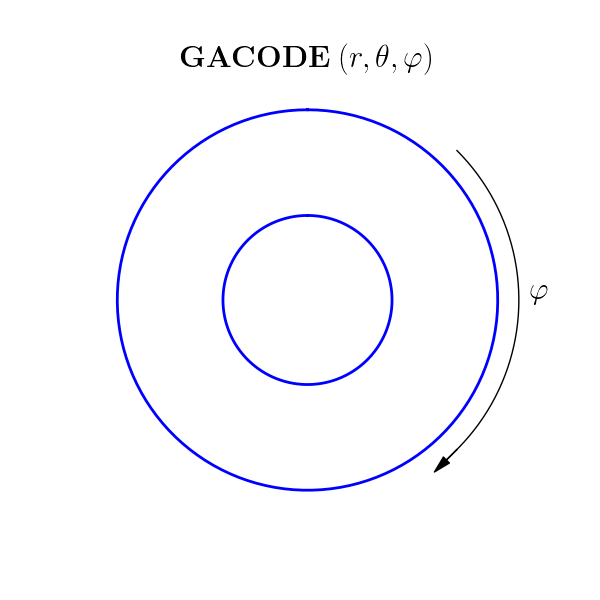

FLUX-SURFACE GEOMETRY
=====================

Coordinates
-----------

GYRO/CGYRO/NEO use a right-handed (positively-oriented), field-aligned coordinate system
:math:`(r,\theta,\alpha)` and the Clebsch field representation

.. math::

   \mathbf{B} =\nabla \alpha \times \nabla \psi (r) \; ,

where :math:`\psi` is the poloidal flux divided by :math:`2\pi` and

.. math::
   
    \alpha =\varphi +\nu (r,\theta ) 

is the Clebsch angle. Here, :math:`\varphi` is the **toroidal angle**, oriented as shown
in the figure below, and :math:`\theta` is the **poloidal angle** which increases as one
moves counterclockwise along the flux-surface (shown in blue). The **minor radius**
:math:`r` is in all cases taken to be one-half the width of the flux-surface at
the elevation, :math:`Z_{c}`, of the flux-surface centroid.
   
.. figure:: image/flux_surface.png
	:scale: 100%
	:alt: flux surface
	:align: center

The coordinate systems :math:`(R,Z,\varphi)` and :math:`(r,\theta,\varphi)` are positively oriented.
		
Generalized minor radius
------------------------

The minor radius variable, :math:`r`, used in GYRO/CGYRO/NEO is the half-width of the flux surface at
the height, :math:`Z_{c}`, of the centroid:

.. math::
   
   r \doteq \frac{R_{+}-R_{-}}{2} \; .

This definition is valid in all cases; that is, for circular equilibria, as well as for
shaped Grad-Shafranov (Miller) and general equilibrium. 

Generalized major radius
------------------------

The major radius variable, :math:`R_{0}`, used in GYRO/CGYRO/NEO is the average of the maximum and
minimum major radius of the flux-surface at the height, :math:`Z_{c}`, of the centroid:

.. math::
   
    R_{0}=\frac{R_{+}+R_{-}}{2} \; .

This definition is valid in all cases; that is, for circular equilibria, as well as for
shaped Grad-Shafranov (Miller) and general equilibrium.

Effective field
---------------

The effective field strength, :math:`B_{\rm {unit}}`, is defined as

.. math::

   B_\mathrm{unit} = \frac{1}{r} \frac{d\chi _{t}}{dr} \; ,

where :math:`\chi _{t}` is the toroidal flux divided by :math:`2\pi`. This gives the
roughly equivalent field that would be obtained if the flux surface was deformed to a circle.

Equilibria
----------

GYRO/CGYRO/NEO can be run using **circular equilibrium** or **shaped Grad-Shafranov equilibrium**.

**(1) Circular equilibrium**

- The flux surfaces, which are **not** local G-S equilibria, have the form:

 .. math::

    R(r,\theta) &= R_0 + r \cos \theta \\
    Z(r,\theta) &= r \sin \theta \\
    \nu(r,\theta) &= -q(r) \theta

- GYRO: select :ref:`gyro_radial_profile_method` = 1    
- CGYRO: select :ref:`cgyro_equilibrium_model` = 1
- NEO: select :ref:`neo_equilibrium_model` = 0  
  
**(2) Shaped Grad-Shafranov equilibrium**

- The flux surfaces, which are local G-S equilibria, have the parameterization:

.. math::

    R(r,\theta) &= R_0(r) + r \cos \left[\theta + \sum_n c_n(r) \cos(n \theta) + \sum_m s_m(r) \sin(m \theta) \right] \\
    Z(r,\theta) &= Z_0(r) + \kappa(r) r \sin \theta  \\
    \nu(r,\theta) & \rm{\;is\; computed \;numerically}

-  Here :math:`c_n` are anti-symmetric moments and :math:`s_m` are symmetric moments.  Physically, :math:`c_0` is the tilt, :math:`c_1` is the ovality, :math:`s_1=\arcsin[\delta(r)]` where :math:`\delta` is the triangularity, and :math:`s_2=-\zeta` where :math:`\zeta` is the squareness.
- GYRO: select :ref:`gyro_radial_profile_method` = 5  or :ref:`gyro_radial_profile_method` = 3 with :ref:`gyro_num_equil_flag` = 0 
- CGYRO: select :ref:`cgyro_equilibrium_model` = 2
- NEO: select :ref:`neo_equilibrium_model` = 2 or :ref:`neo_profile_equilibrium_model` = 1
- For local simulations, also specify shape parameters.  For experimental profiles, shape parameters are auto-generated from profile data.
    
  
Table of geometry parameters
----------------------------

.. csv-table::
   :header: "Symbol", "input.gyro parameter", "input.cgyro parameter", "input.neo parameter", "Circular (1)", "Shaped (2a)", "Exp. Shaped (2b)"   
   :widths: 5, 5, 5, 5, 5, 5, 5
	   
	:math:`r/a`, :ref:`gyro_radius`, :ref:`cgyro_rmin`, :ref:`neo_rmin_over_a`, x, x, x
	:math:`R_0(r)/a`, :ref:`gyro_aspect_ratio`, :ref:`cgyro_rmaj`, :ref:`neo_rmaj_over_a`, x, x, C
	:math:`\partial R_0/\partial r`, :ref:`gyro_shift`, :ref:`cgyro_shift`,:ref:`neo_shift`, , x, C
	:math:`Z_0(r)/a`, :ref:`gyro_zmag`, :ref:`cgyro_zmag`,:ref:`neo_zmag_over_a`, , x, C
	:math:`\partial Z_0/\partial r`, :ref:`gyro_dzmag`, :ref:`cgyro_dzmag`,:ref:`neo_s_zmag`, , x, C     
	:math:`q`, :ref:`gyro_safety_factor`, :ref:`cgyro_q`, :ref:`neo_q`, x, x, C
	:math:`s`, :ref:`gyro_shear`, :ref:`cgyro_s`, :ref:`neo_shear`, x, x, C
	:math:`\kappa`, :ref:`gyro_kappa`, :ref:`cgyro_kappa`,:ref:`neo_kappa`, , x, C
	:math:`s_\kappa`, :ref:`gyro_s_kappa`, :ref:`cgyro_s_kappa`,:ref:`neo_s_kappa`, , x, C
	:math:`\delta`, :ref:`gyro_delta`, :ref:`cgyro_delta`,:ref:`neo_delta`, , x, C
	:math:`s_\delta`, :ref:`gyro_s_delta`, :ref:`cgyro_s_delta`,:ref:`neo_s_delta`, , x, C
	:math:`\zeta`, :ref:`gyro_zeta`, :ref:`cgyro_zeta`,:ref:`neo_zeta`, , x, C
	:math:`s_\zeta`, :ref:`gyro_s_zeta`, :ref:`cgyro_s_zeta`,:ref:`neo_s_zeta`, , x, C
	:math:`c_0`, :ref:`gyro_shape_cos0`, :ref:`cgyro_shape_cos0`,:ref:`neo_shape_cos0`, , x, C
	:math:`s_{c_0}`, :ref:`gyro_shape_s_cos0`, :ref:`cgyro_shape_s_cos0`,:ref:`neo_shape_s_cos0`, , x, C
	:math:`c_1`, :ref:`gyro_shape_cos1`, :ref:`cgyro_shape_cos1`,:ref:`neo_shape_cos1`, , x, C
	:math:`s_{c_1}`, :ref:`gyro_shape_s_cos1`, :ref:`cgyro_shape_s_cos1`,:ref:`neo_shape_s_cos1`, , x, C
	:math:`c_2`, :ref:`gyro_shape_cos2`, :ref:`cgyro_shape_cos2`,:ref:`neo_shape_cos2`, , x, C
	:math:`s_{c_2}`, :ref:`gyro_shape_s_cos2`, :ref:`cgyro_shape_s_cos2`,:ref:`neo_shape_s_cos2`, , x, C
        :math:`c_3`, :ref:`gyro_shape_cos3`, :ref:`cgyro_shape_cos3`,:ref:`neo_shape_cos3`, , x, C
	:math:`s_{c_3}`, :ref:`gyro_shape_s_cos3`, :ref:`cgyro_shape_s_cos3`,:ref:`neo_shape_s_cos3`, , x, C
	:math:`s_3`, :ref:`gyro_shape_sin3`, :ref:`cgyro_shape_sin3`,:ref:`neo_shape_sin3`, , x, C
	:math:`s_{s_3}`, :ref:`gyro_shape_s_sin3`, :ref:`cgyro_shape_s_sin3`,:ref:`neo_shape_s_sin3`, , x, C      
	:math:`\beta_e`, :ref:`gyro_betae_unit`, :ref:`cgyro_betae_unit`, NA, , x, C
	:math:`\beta_*` scaling, :ref:`gyro_betaprime_scale`, :ref:`cgyro_beta_star_scale`, :ref:`neo_beta_star`, x, x, x
	BTCCW, :ref:`gyro_btccw`, :ref:`cgyro_btccw`, :ref:`neo_btccw`, x, x, C
	IPCCW, :ref:`gyro_ipccw`, :ref:`cgyro_ipccw`, :ref:`neo_ipccw`, x, x, C
	      
In the table:

- x denotes the direct use of the parameter as specified in input.gyro, input.cgyro, input.neo,

- C means the parameter is computed from data in input.profiles

- D means the parameter is not part of the model and is not used (although the effective value is printed for diagnostic purposes)

For further information about geometry and normalization conventions, consult the GYRO Technical Guide   :cite:`candy:2010`.

Magnetic field orientation
--------------------------

GACODE uses a right-handed (positively-oriented), field-aligned coordinate system :math:`(r,\theta,\varphi)`, whereas DIII-D uses a (positively-oriented) cylindrical system :math:`(R,\phi,Z)`.  Looking down on the tokamak from above, the orientation of the GACODE toroidal angle is clockwise, whereas the DIII-D toroidal angle is counter-clockwise:

.. figure:: image/Orient_d3d.png
	:scale: 100%
	:alt: flux surface
	:align: center		

In reality, quantities like the safety factor and poloidal flux have definite signs. Historically, these signs have been suppressed or neglected in both theory and modeling. For proper treatment of momentum transport, however, these signs must be retained. We can infer typically neglected signs by knowing :ref:`cgyro_ipccw` and :ref:`cgyro_btccw`. For example:

- sign(:math:`B_{\rm tor}`) = -BTCCW
- sign(:math:`B_{\rm pol}`) = -IPCCW
- sign(:math:`\psi_{\rm pol}`) = -IPCCW
- sign(:math:`q`) = IPCCW :math:`\times` BTCCW

The standard configuration in DIII-D is shown below.

.. figure:: image/Orient_d3d_standard.png
	:scale: 100%
	:alt: flux surface
	:align: center

This corresponds to :ref:`cgyro_ipccw` = 1 and :ref:`cgyro_btccw` =-1.  Thus, in GACODE coordinates, we expect:

- sign(:math:`B_{\rm tor}`) = 1
- sign(:math:`B_{\rm pol}`) = -1
- sign(:math:`\psi_{\rm pol}`) = -1
- sign(:math:`q`) = -1

 In other words, the safety factor and poloidal flux are negative in the typical case. This will be reflected in a properly-constructed :doc:`input.profiles <input_profiles>` file. 
