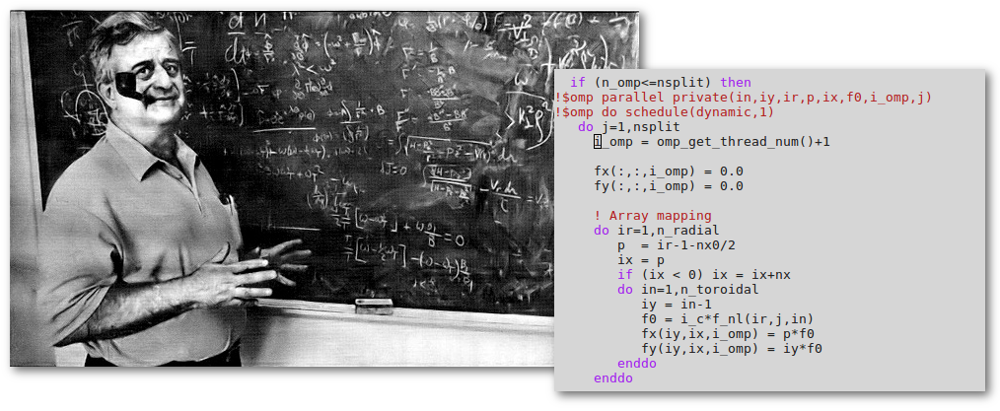

The General Atomics GACODE Suite
================================

GACODE refers to a collection of serial and HPC software developed by the Theory Group
at `General Atomics <http://www.ga.com/magnetic-fusion>`_, and distributed through
the `GACODE source code repository <https://github.com/gafusion/gacode/>`_ at GitHub.

Running GACODE
--------------

There are numerous :doc:`public installations <setup>` of GACODE (via `AToM <https://scidac.github.io/atom>`_ or local maintainers).  You can also :doc:`install and build <build>` the GACODE suite from sources to run on your desktop or laptop.

Geometry
--------

A description of the unified method used to describe :doc:`flux-surface geometry <geometry>`.

Plasma Rotation
---------------

Some notes about the Hinton-Sugama formulation of plasma rotation :doc:`plasma rotation <rotation>`.

Equilibrium and Profiles
------------------------

GACODE software works with the :ref:`input.gacode` format.   

.. toctree::
   :maxdepth: 4
   :caption: Software

   license
   download
   setup
   build
   zreferences

.. toctree::
   :maxdepth: 4
   :caption: Codes

   neo
   tgyro
   cgyro
   gyro
   tglf
   prgen

.. toctree::
   :caption: Physics

   geometry
   rotation
   input_gacode
   misc
