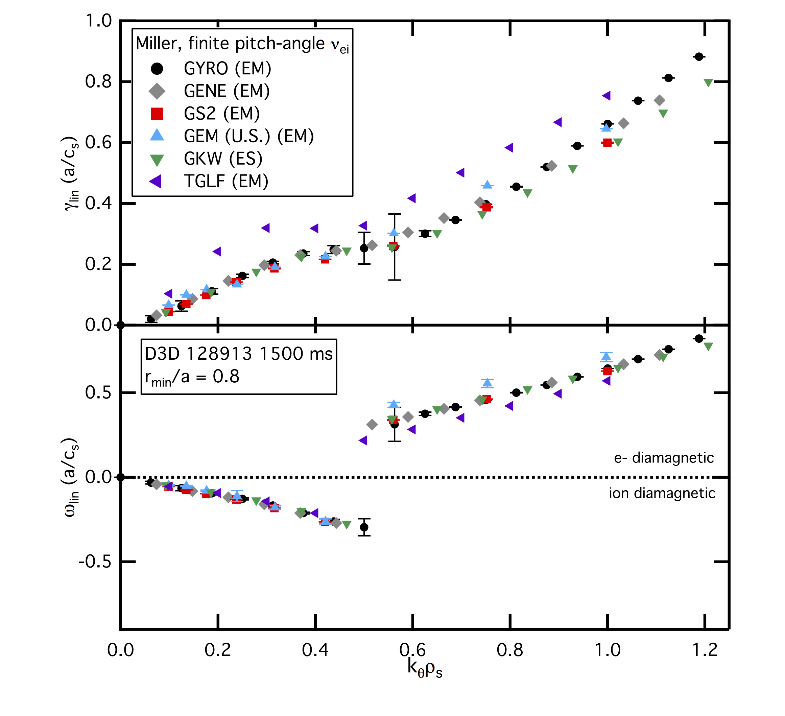
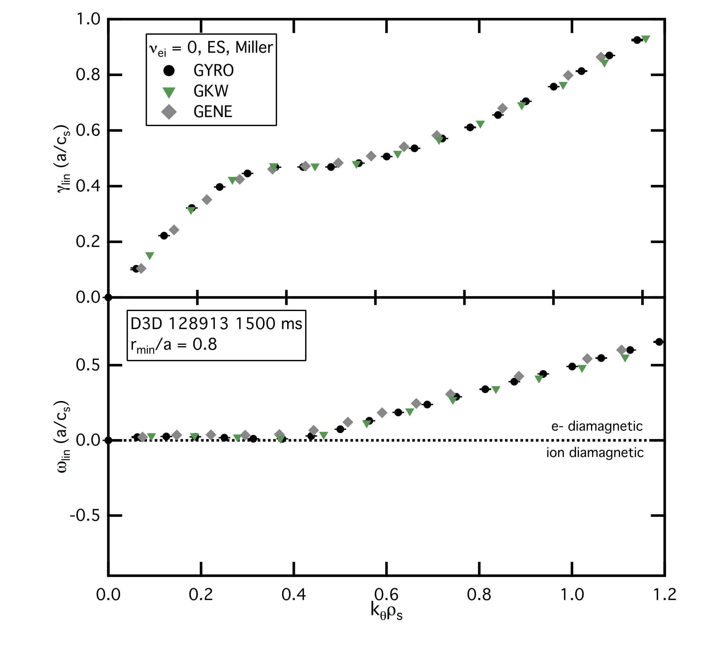

.. _shortfall:

DIII-D L-mode shortfall
=======================

.. |ip| replace:: :doc:`input.profiles <input_profiles>`
.. |GYRO| replace:: :doc:`GYRO <gyro>`
.. |TGLF| replace:: :doc:`TGLF <tglf>`
.. |GKW| replace:: `GKW`
.. _GKW: https://bitbucket.org/gkw/gkw/wiki/Home    
.. |GS2| replace:: `GS2`
.. _GS2: https://bitbucket.org/gyrokinetics/gs2/wiki/Home   
.. |GEM| replace:: `GEM`
.. _GEM: https://www.colorado.edu/center/cips/research/plasma-theory-and-simulation/gem-electromagnetic-gyrokinetic-turbulence-simulation
.. |GENE| replace:: `GENE`
.. _GENE: http://genecode.org
		  
Overview
--------

This webpage is designed to serve as a central common resource and collaboration tool for research into the so-called "shortfall" observed in some gyrokinetic and gyrofluid predictions of DIII-D near-edge (:math:`\rho_{tor}=0.75`) transport and fluctuations levels, and the ITPA T&C group work on this topic.  Below are links to key references documenting the issue, equilibrium profiles (in the GACODE input.profiles ASCII format) for DIII-D shot 128913 @ 1500 ms which has been the primary discharge for investigating this issue, and results to date from various codes. We encourage and welcome any and all groups interested in investigating this issue with their model or theory to use the profile data below, and compare their results against those documented here.  Questions and comments should be directed to `Chris Holland <mailto:chholland@ucsd.edu>`_.

Key publications and presentations
----------------------------------
#. Initial publication of discharge characteristics and |GYRO| comparisons.

   - A. \E. White *et al.*, “Measurements of core electron temperature and density fluctuations in DIII-D and comparison to nonlinear gyrokinetic simulations”, *Physics of Plasmas* **15** 056116 (2008) :cite:`white:2008`
	
#. More detailed |GYRO| comparisons including documentation of synthetic diagnostic implementation.

   - C. Holland *et al.*, “Implementation and Application of Two Synthetic Diagnostics for Validating Simulations of Core Tokamak Turbulence”, *Physics of Plasmas* **16** 052301 (2009) :cite:`holland:2009`

#.  2012 ITPA presentation examing shortfall issue across multiple DIII-D dishcharges using |TGLF|.

    - :download:`C. Holland 2012 Transport & Confinement ITPA presentation <shortfall/Holland_2012_fall_ITPA.pdf>`
     
#. |GYRO|-|GS2|_ benchmark at :math:`\rho_{tor}=0.5` for this discharge.

   - R. \V. Bravenec, J. Candy, M. Barnes, and C. Holland, “Linear and nonlinear verification of gyrokinetic microstability codes”, *Physics of Plasmas* **18** 122505 (2011) :cite:`bravenec:2011`

#. Local and global predictions from |GEM|_ code for this discharge. **NOTE: these simulations use similar but not identitical experimental profiles as other publications listed here**.

   - J. Chowdhury *et al.*, "Study of the L-mode tokamak plasma 'shortfall' with local and global nonlinear gyrokinetic :math:`\delta f` particle-in-cell simulation", *Physics of Plasmas* **21** 112503 (2014) :cite:`chowdhury:2014`
   
#. Analysis of this discharge using |GENE|_ code.

   - T. Görler *et al.*, "A flux-matched gyrokinetic analysis of DIII-D L-mode turbulence", *Physics of Plasmas* **21** 122307 (2014) :cite:`görler:2014`
   
#. Validation tutorial article documenting systematic near-edge shortfall observations with |GYRO| for multiple DIII-D L-mode discharges (including shot #128913)

   - C. Holland, "Validation metrics for turbulent plasma transport", *Physics of Plasmas* **23** 060901 (2016) :cite:`holland:2016`
   

EXPERIMENTAL profiles
---------------------
* Equilibrium profiles (including Miller parameterization of magnetic geometry) in |ip| format are available here:

  - :download:`input.profiles <shortfall/input.profiles.128913_shortfall.txt>`

  - :download:`input.profiles.extra <shortfall/input.profiles.extra.128913_shortfall.txt>`

  - :download:`input.profiles.geo <shortfall/input.profiles.geo.128913_shortfall.txt>`

* Those interested in examining possible up-down asymmetry effects can refer to the associated input.profiles.geo file above. Alternatively, the EFIT gEQDSK file used for this analysis can be downloaded :download:`here <shortfall/g128913.01500_shortfall.txt>`. Also available for download are the ONETWO :download:`iterdb <shortfall/D3D_iterdb_kinefit_128913.01500>` and :download:`CER rotation <shortfall/dplasma_cer_format.128913.1500>` files used to generate the |ip| files above.

* Older versions of these files, used in references above and results shown below are also availble. These files have the same data as the more recent versions above, but in a slightly different format that will not be accurately read by current GACODE codes. **These files are provided only for reference, and should not be used in future studies**.
  
  - :download:`OLD input.profiles <shortfall/old.input.profiles.128913_shortfall.txt>`

  - :download:`OLD input.profiles.geo <shortfall/old.input.profiles.geo.128913_shortfall.txt>`
	      
* Note that there may be small numerical (but not qualitative) differences between the profiles in these files and the values reported in :cite:`holland:2009` due to 10 years of code evolution since the original publication.  We **strongly** urge all future work use the most recent :ref:`input.gacode` file for future studies, to ensure a common starting point and basis for comparison.

GYRO results
------------

* A series of linear electrostatic initial-value growth rate convergence calculations have been performed, the results of which are shown here

  .. image:: shortfall/figures/d3d128913.r8.linscan.convergence.png
	:width: 100 %
	:alt: b250

* The base case (electrostatic, finite electron-ion collisions, drift-kinetic electrons) |GYRO| input file can be found
  :download:`here <shortfall/input.gyro.128913_shortfall.txt>`
  and output summary file
  :download:`here <shortfall/out.gyro.run.128913_shortfall.txt>`.
  
* Error bars are plotted as standard deviations of time-averaged values, generally taken over :math:`t=[30:\, \ge 100] a/c_s`.  

* Text files with results for this figure can be found here:
  
  - :download:`base case <shortfall/ES_collon_linfreq.128913_shortfall.txt>`
  - :download:`h=0.005 <shortfall/ES_dt5e-3_linfreq.128913_shortfall.txt>`
  - :download:`NX=50 <shortfall/ES_dt5e-3_linfreq.128913_shortfall.txt>`
  - :download:`h=0.005 <shortfall/ES_dt5e-3_linfreq.128913_shortfall.txt>`
  - :download:`ENERGY_GRID=10 <shortfall/ES_EG10_linfreq.128913_shortfall.txt>`
  - :download:`PASS_GRID=TRAP_GRID=5 <shortfall/ES_PTG5_linfreq.128913_shortfall.txt>`
  - :download:`ORBIT_GRID=10, PASS_GRID=TRAP_GRID=5 <shortfall/ES_OG10PTG5_linfreq.128913_shortfall.txt>`
  - :download:`5th-order RBF <shortfall/ES_RBF5_linfreq.128913_shortfall.txt>`
  
* A second set of physics tests have been done, examining the effects of using only adiabatic electrons, inclusion of ion-electron collisions, and electromagnetic effects.  These results can be seen here

  .. image:: shortfall/figures/d3d128913.r8.linscan.physics.png
	:width: 100 %
	:alt: b250
	      
* Text files with results for this figure can be found here:

  - :download:`adiabatic electrions <shortfall/AE_linfreq.128913_shortfall.txt>`
  - :download:`ES & nu_ei = 0 <shortfall/ES_colloff_linfreq.128913_shortfall.txt>`
  - :download:`ES & finite nu_ei <shortfall/ES_collon_linfreq.128913_shortfall.txt>`
  - :download:`EM & nu_ei = 0 <shortfall/EM_colloff_linfreq.128913_shortfall.txt>`
  - :download:`EM & finite nu_ei <shortfall/EM_collon_linfreq.128913_shortfall.txt>`

GKW results (added 25-jan-2013)
---------------------------------

.. image:: shortfall/figures/GKW_physics_freq.png
	:width: 48 %
	:alt: b250
.. image:: shortfall/figures/GKW_physics_gamma.png
	:width: 48 %
	:alt: b250

* Text files for electrostatic |GKW|_ electrostatic growth rates with:

  - :download:`no collisions <shortfall/ES_colloff_linfreq.GKW.128913_shortfall.txt>`
  - :download:`pitch-angle scattering <shortfall/ES_pacollon_linfreq.GKW.128913_shortfall.txt>`

Cross-code benchmarking results
-------------------------------
* The first completed benchmarking study compares results from the gyrokinetic |GYRO|, |GS2|_, |GEM|_, and |GENE|_ codes, as well as the gyrofluid |TGLF| model.  |GYRO|, |GS2|_, |GKW|_ and |GENE|_ are continuum Eulearian (although with different velocity-space discretizations) codes, while |GEM|_ is a particle-in-cell code.  Unless otherwise noted, the results shown below are for electromagnetic, collisional simulations with a single gyrokinetic ion species.

* **Update 25-jan-2013:** Results from the continuum gyrokinetic |GKW|_ code have been added.
* **Update 27-mar-2013:** Results from the gyrofluid |TGLF| model have been added.
* **Update 30-may-2013:** Results from the continuum gyrokinetic |GENE|_ code have been added.

* Individual code results are here for cases with finite collisions:

  - :download:`GYRO <shortfall/EM_collon_linfreq.128913_shortfall.txt>`
  - :download:`GS2 <shortfall/EM_collon_linfreq.GS2.128913_shortfall.txt>`
  - :download:`GEM <shortfall/EM_collon_linfreq.GEM.128913_shortfall.txt>`
  - :download:`GKW <shortfall/ES_pacollon_linfreq.GKW.128913_shortfall.txt>`
  - :download:`TGLF <shortfall/EM_collon_linfreq.TGLF.128913_shortfall.txt>`
  - :download:`GENE <shortfall/D3D_128913_lin_em_miller_pitch_GENE.txt>`

* Comparison of |GYRO|, |GKW|_, and |GENE|_ linear calculations with no collisions and Miller geometry

*Individual code results are here for cases with no collisions:
   - :download:`GYRO <shortfall/ES_colloff_linfreq.128913_shortfall.txt>`
   - :download:`GKW <shortfall/ES_colloff_linfreq.GKW.128913_shortfall.txt>`
   - :download:`GENE <shortfall/D3D_128913_lin_es_miller_colloff_GENE.txt>`

     
Acknowledgments
-------------------------------
Thanks to Ron Bravenec for providing the |GS2|_ and |GEM|_ data, Yann Camenen for the |GKW|_ results, and Tobias Görler for the |GENE|_ results.

   
